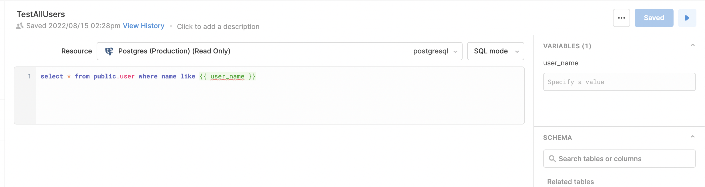
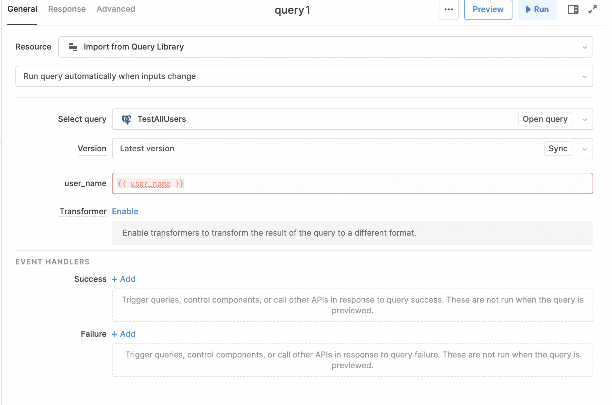
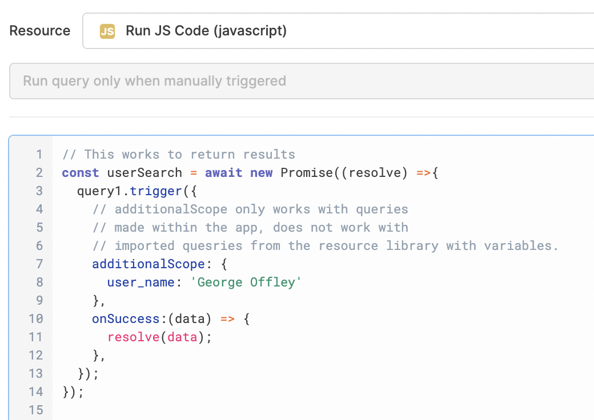

# Using Variables with Shared Queries

When you make shared queries with variables you can also use those variables in apps.

When you create the shared queries you make sure to add in variables like this `{{ user-id }}`.

You then need to make sure to fill out variables when you import them into the app. So when you click on the query you set `{{ user_id }}` as the value. 

Then you are able to use things like `additionalScope` when triggering queries.

#GeneralTools 
	#Retool 