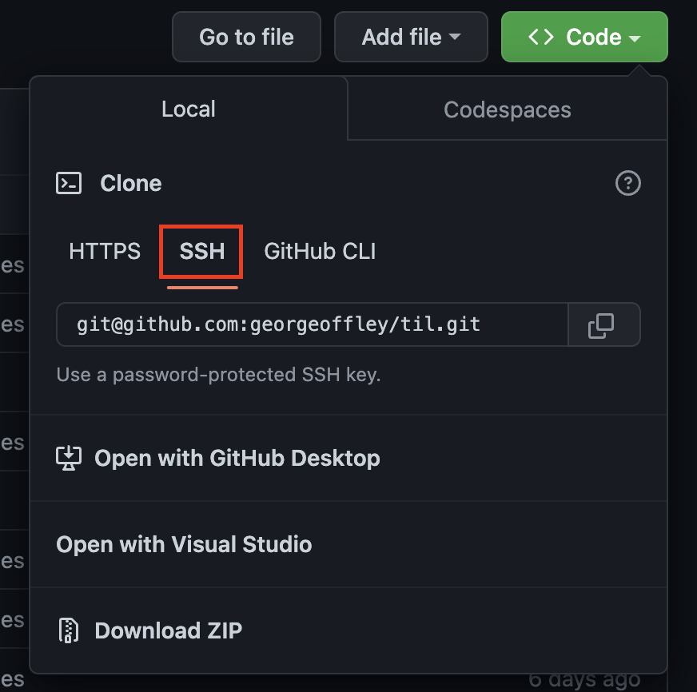

# Git SSH Cloning

---
## Explanation and Notes

When you have SSH set up with GitHub, you need to make sure you are using the SSH link when cloning stuff from GitHub. 

If you try running `git clone` with, for example, the first link the clone button opens up to (the HTTPS link) your computer which is setup to use SSH while ask you to login with GitHub credentials and might just error out. 

See the image below to see where to find that.

---

#Git