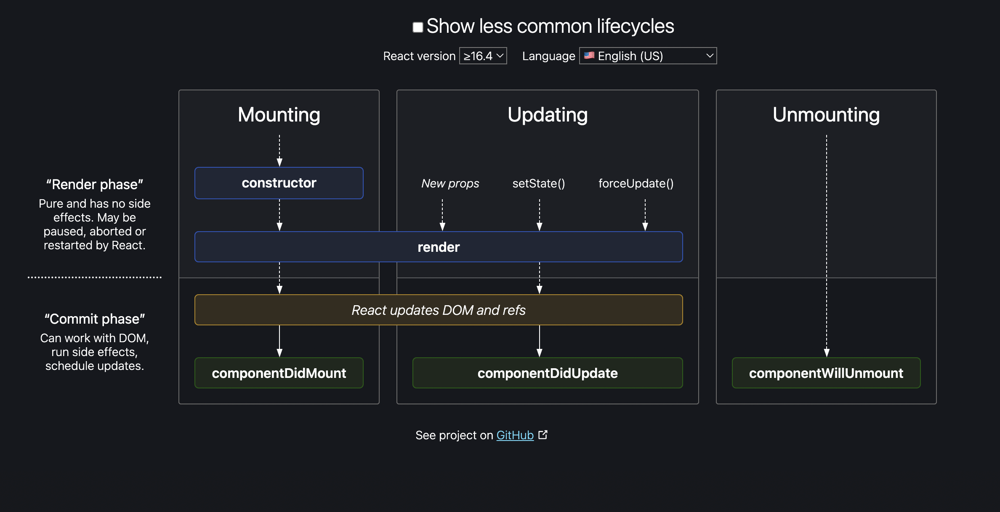

# `componentDidMount()` in React

[Docs Resource](https://reactjs.org/docs/react-component.html#componentdidupdate)

The `componentDidMount()` is a built-in method for `React.Component` objects

It is one of a few methods that are called during the lifecycle of a component see the image below for visual of a lifecycle.

The above can be found here to use interactively: [https://projects.wojtekmaj.pl/react-lifecycle-methods-diagram/](https://projects.wojtekmaj.pl/react-lifecycle-methods-diagram/)

These methods can be overridden with custom logic for us to run code when something happens in the lifecycle

For example, we can run code when a component is created and starting the `Mounting` phase by adding in a `constructor()` method in the code.

For this example, we’re overriding the `componentDidMount()` method which will fire when a component “mounts” correctly.

Full docs for react component object: [https://reactjs.org/docs/react-component.html](https://reactjs.org/docs/react-component.html)