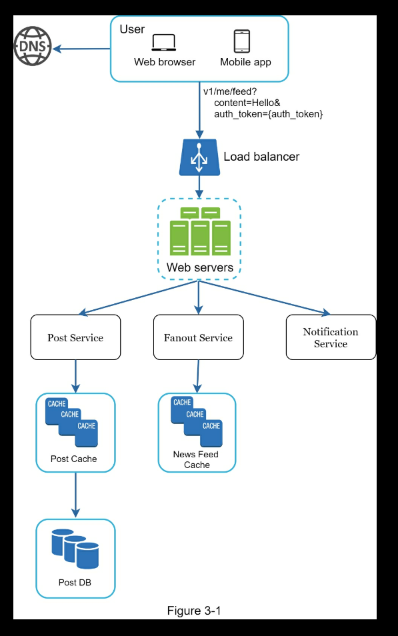
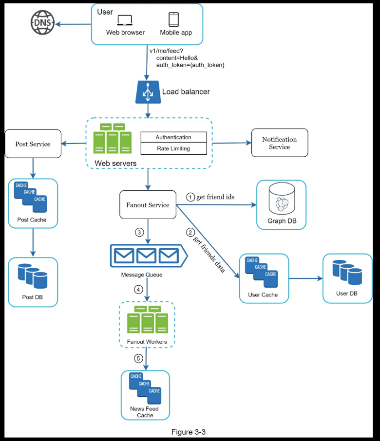
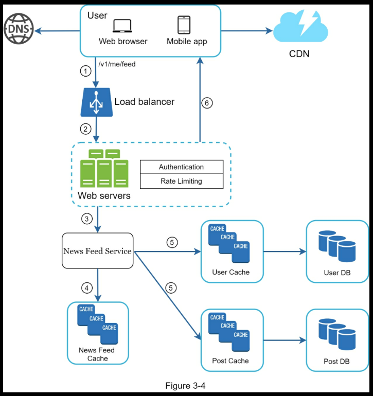

# Chapter 3

## Notes

> The ability to ask good questions is also an essential skill, and many interviewers specifically look for this skill.
> 
> 
> Xu, Alex. System Design Interview – An Insider's Guide (p. 51). Byte Code LLC. Kindle Edition.
> 

### 4 Steps for Effective System Design Interview

1. **Ask questions to understand the problem and establish the scope of the design**
    1. Do not jump into an answer. To effectively design a system you need to ask question to establish all the details. Once you have those details, write them down.
    2. Some example questions
        1. What specific features are you building?
        2. How many users does the product have?
        3. How fast does the company anticipate to scale up? 3 month, 6 month, 1 year projections
        4. What is the companies technology stack? What existing services would we might need to leverage to simplify the design?
    3. Below is a good example of what that back and forth might look like.
        
        > **Candidate**: Is this a mobile app? Or a web app? Or both? 
        **Interviewer**: Both. 
        **Candidate**: What are the most important features for the product? 
        **Interviewer**: Ability to make a post and see friends’ news feed. 
        **Candidate**: Is the news feed sorted in reverse chronological order or a particular order? The particular order means each post is given a different weight. For instance, posts from your close friends are more important than posts from a group. 
        **Interviewer**: To keep things simple, let us assume the feed is sorted by reverse chronological order. 
        **Candidate**: How many friends can a user have? 
        **Interviewer**: 5000 
        **Candidate**: What is the traffic volume? 
        **Interviewer**: 10 million daily active users (DAU) 
        **Candidate**: Can feed contain images, videos, or just text? Interviewer: It can contain media files, including both images and videos.
        > 
        > 
        > Xu, Alex. System Design Interview – An Insider's Guide (pp. 53-54). Byte Code LLC. Kindle Edition.
        > 
2. Propose a high-level design and get feedback from the interviewer
    1. Create a simple initial blueprint of the system, at the highest level.
    2. Check in with the interviewer to figure out if that road makes sense.
    3. Collaborate with the interviewer to figure out the scope at this step. Do we need to worry about API layer, data layer, caching, do we need to do some math to see if this system will meet our requirements or should that come in later?
    4. Possibly go through some use cases to find glaring edge cases
    5. Make sure you are accounting for services needed to satisfy the needs of the system
        1. In the case of a newfeed like service you’re making a box for things like the post service, notification service, newsfeed service, etc.
    6. Example high-level design 
        
        
        
3. Design Deep Dive
    1. The following should be agreed upon by you and the interviewer
        1. Agreed on all goasl and in scope features
        2. High level design is sketched out and agreed upon
        3. Obtained feedback from the interviewer about high level design
        4. Had some initial ideas about areas to focus on in deep dive based on feedback
    2. Work with interviewer to design on highest priority areas to dive into
    3. Time management is essential at this step
    4. Example deep dive update 
        
        
        
        
        
4. Wrap Up
    1. Follow up questions
    2. Identify bottlenecks and discuss improvements
    3. Error cases
    4. Edge cases

### Dos and Don’ts

> **Dos**
> - Always ask for clarification. Do not assume your assumption is correct. 
> - Understand the requirements of the problem. 
> - There is neither the right answer nor the best answer. A solution designed to solve the problems of a young startup is different from that of an established company with millions of users. Make sure you understand the requirements. 
> - Let the interviewer know what you are thinking. Communicate with your interview. 
> - Suggest multiple approaches if possible. 
> - Once you agree with your interviewer on the blueprint, go into details on each component. Design the most critical components first.

> **Don’ts**
> 
> - Don't be unprepared for typical interview questions.
> - Don’t jump into a solution without clarifying the requirements and assumptions.
> - Don’t go into too much detail on a single component in the beginning. Give the high-level design first then drills down.
> - If you get stuck, don't hesitate to ask for hints.
> - Again, communicate. Don't think in silence.
> - Don’t think your interview is done once you give the design. You are not done until your interviewer says you are done. Ask for feedback early and often.
> 
> Xu, Alex. System Design Interview – An Insider's Guide (p. 61). Byte Code LLC. Kindle Edition.
> 

### Suggestions for Time Allocation

> Step 1 Understand the problem and establish design scope: 3 - 10 minutes 
Step 2 Propose high-level design and get buy-in: 10 - 15 minutes 
Step 3 Design deep dive: 10 - 25 minutes 
Step 4 Wrap: 3 - 5 minutes
> 
> 
> Xu, Alex. System Design Interview – An Insider's Guide (p. 61). Byte Code LLC. Kindle Edition.
>